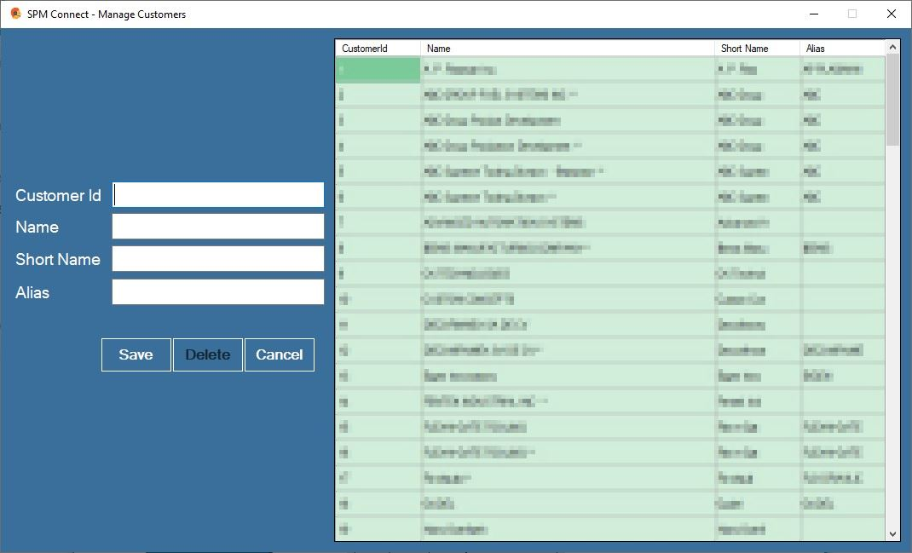
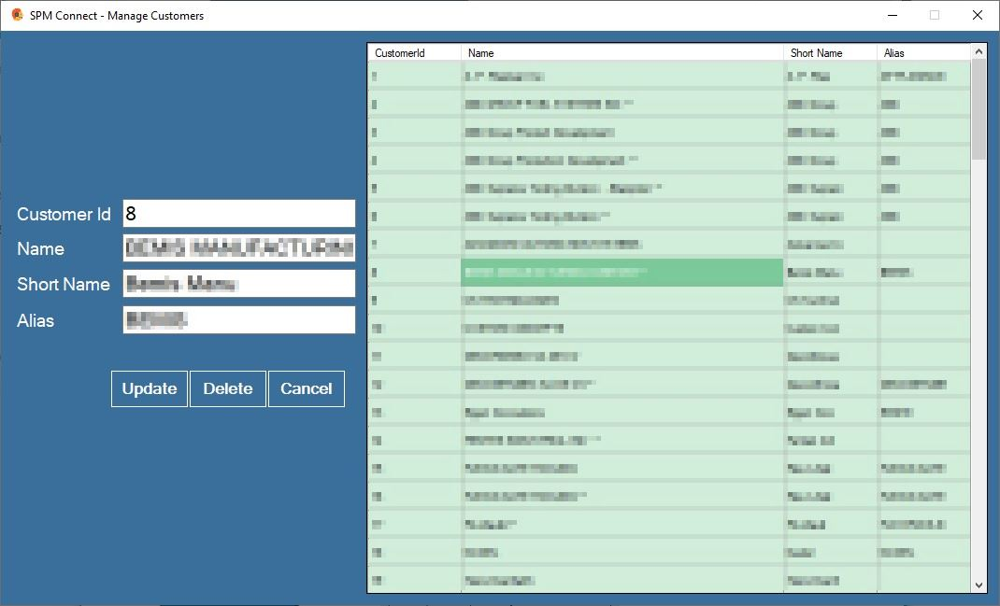

# Manage Customers

This module helps to maintain the list of material used on the items manufactured by SPM Automation.

Navigate to **`ManageCustomers`** on the admin control panel.

### To add new customer, simply type the new customer details and hit `Save`

### To update or delete an existing customer-&gt; double the customer name from the list.

Choose `Update` or `Delete`depending upon the operation

