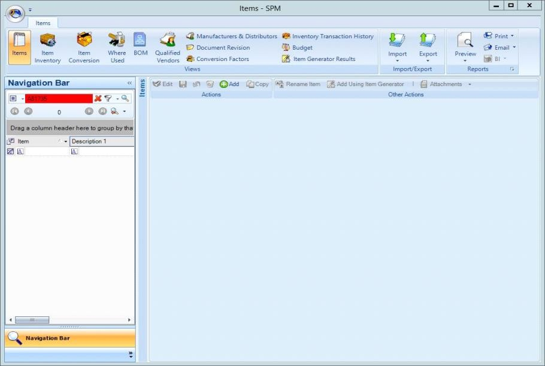
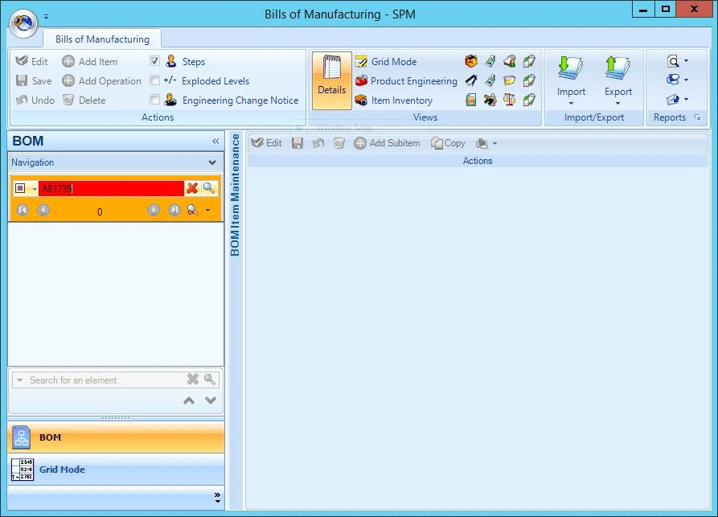
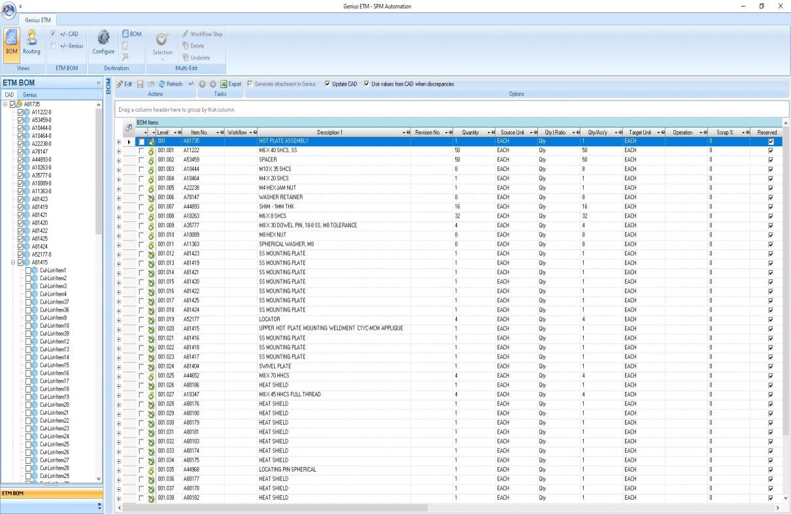
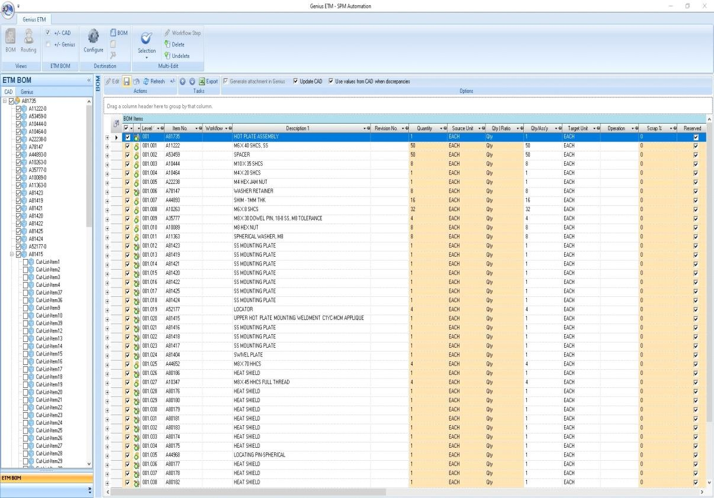
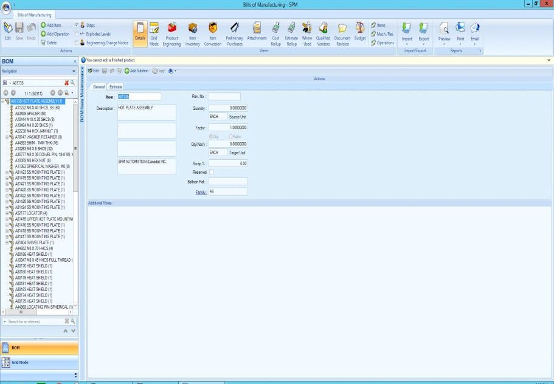
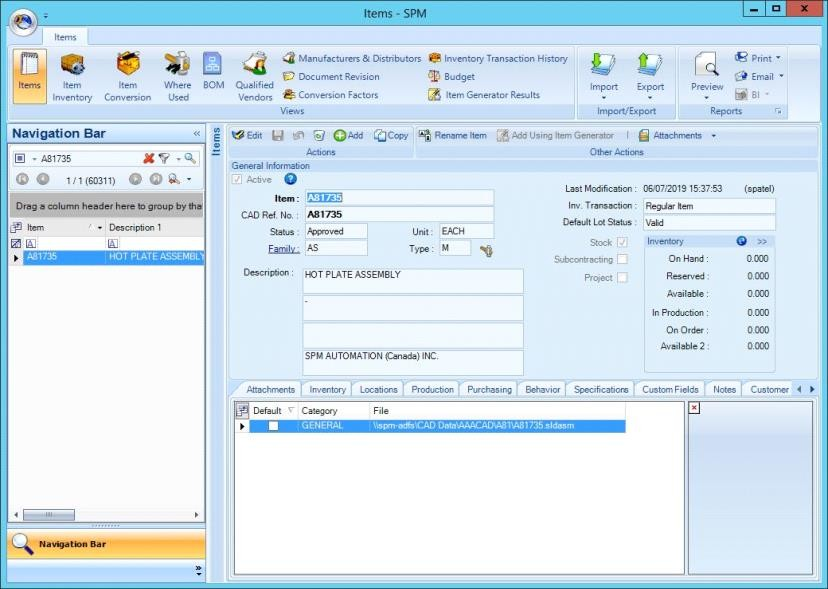

# Creating BOM Using Genius ETM from Solidworks

## Step 1

Using assembly number **A81735** as an example to demonstrate the process.

**Open Solidworks &gt; Open Assy to create BOM for &gt; Make sure all components custom properties are filled out properly &gt; Go to Tools &gt; GeniusETM &gt; GeniusETM**

So far at this step, **A81735** do not exists in Genius database. Pictures below shows red when searched for **A81735** under Genius Items module and Genius Bills of Manufacturing module.

## Step 2

From this step onwards, we will create an entry for **A81735** into Genius.

Check the top level parent in order to select all the childrens underneath.

This will select all the childrens under the parent **A81735**.

## **Step 3**

Uncheck all the items underneath the parent **A81735** which says "CutListItem\*" and click the **BOM** button on top left corner.

The green plus icon infront of all items signifies that items are added or created onto Genius database.

## Step 4

Click the Edit button &gt; Check all components in order to state that all items are required for **A81735** &gt; Which will then check all items underneath &gt; Hit the save button

## **Step 5**

Congratulations!! You successfully created a BOM using Genius ETM from Solidworks.

Images below show that item **A81735** successfully created on Items module and Bills of Manufacturing show **A81735**

with all the components underneath.

