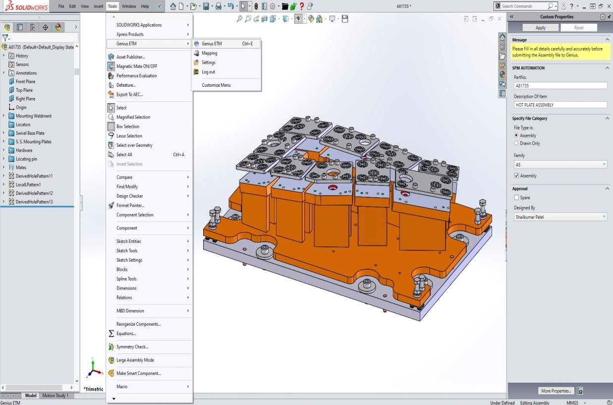
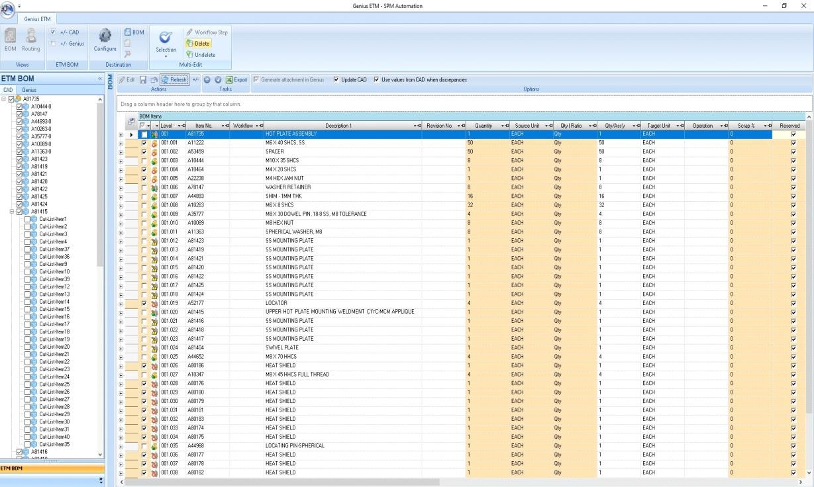
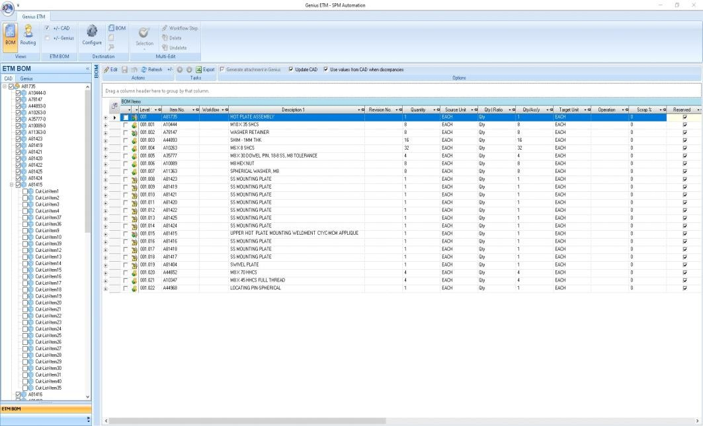

# Updating existing BOM using Solidworks add-in Genius ETM

## Step 1

Using assembly number **A81735** as an example to demonstrate the process.

**Open Solidworks &gt; Open updated Assy to update BOM for &gt; Make sure all components custom properties are filled out properly &gt; Go to Tools &gt; GeniusETM &gt; GeniusETM**

\*Picture below shows updated assembly with less components then the original assembly.

## Step 2

Check the top-level parent in order to select all the children’s underneath. This will select all the children under the parent **A81735**.

Uncheck all the items underneath the parent **A81735** which says "CutListItem\*" and click the **BOM** button on top left corner.

**This will show the discrepancy between the CAD model and Genius existing BOM.**

This will show all the items removed. This is signified by the colored light brown box against each item.

## Step 3

Click the Edit button &gt; Choose Selection button dropdown &gt; Select **Check all items in Genius not in CAD** \(Because we want our model to be reflecting the BOM\).

This option will select all the items which are removed from the assembly.

## Step 4

After checking all items which are getting removed &gt; Click the Delete button. All the removed items will now have a red cross icon.

## Step 5

Hit the **save** button in order to push changes to Genius database.

After saving, Genius ETM will reflect the updated BOM.

## Step 6

Hurray!! You successfully updated a BOM using Genius ETM from Solidworks.

Image below shows that item **A81735** successfully updated Bills of Manufacturing with all the components underneath.

