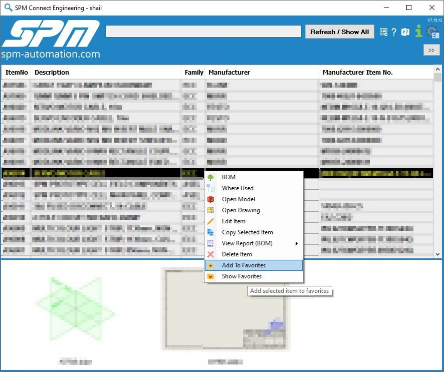

# 🌟Favorites

SPM Connect home page let's you tag items as favorites which basically helps to store items which you use more frequently or want to store items for future reference.

Here's how you to use favorites.

### How to add to Favorites?

Right click on the item you want to add as favorite and click on `Add To Favorites`

### How to access favorites

Right click on the items table -&gt; and click on `Show Favorites`

